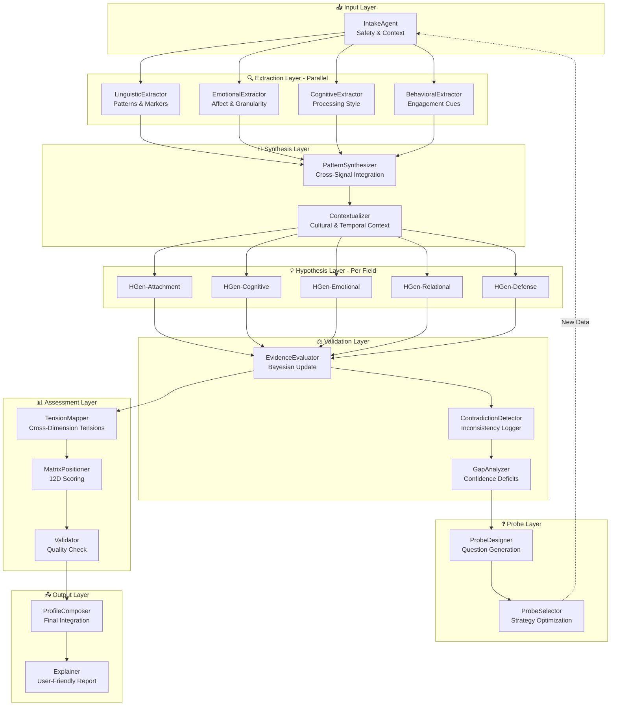
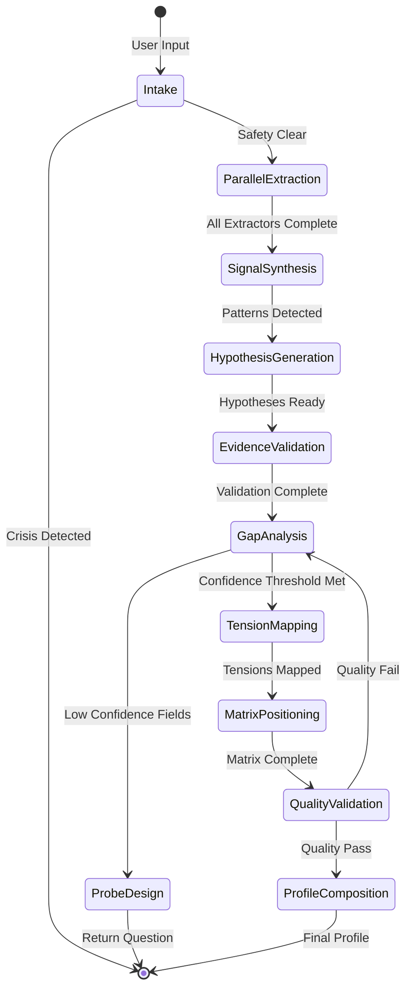
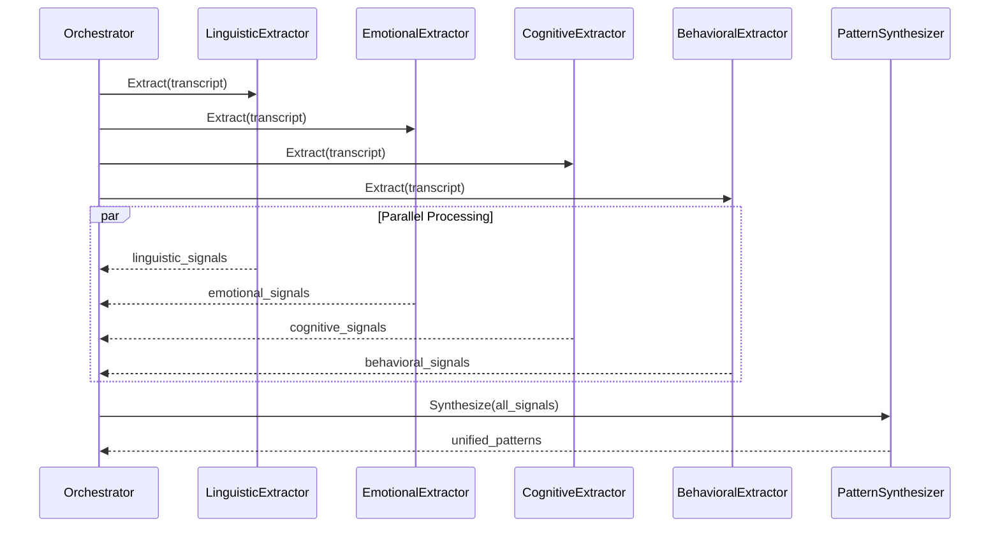
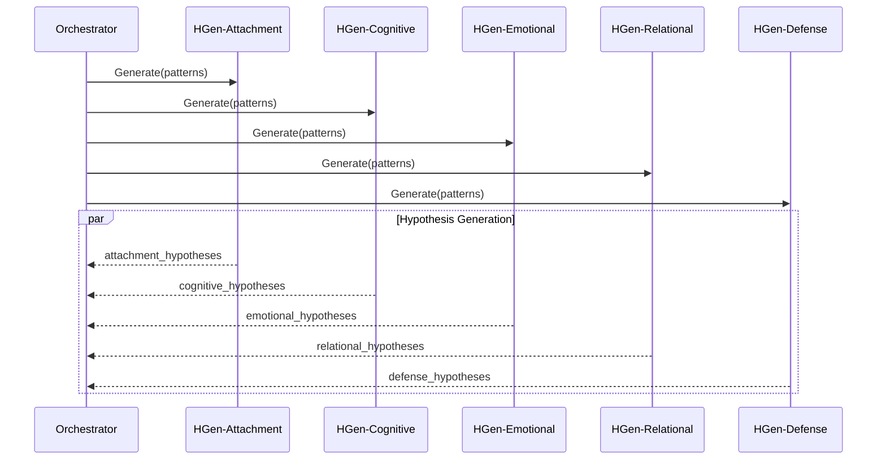
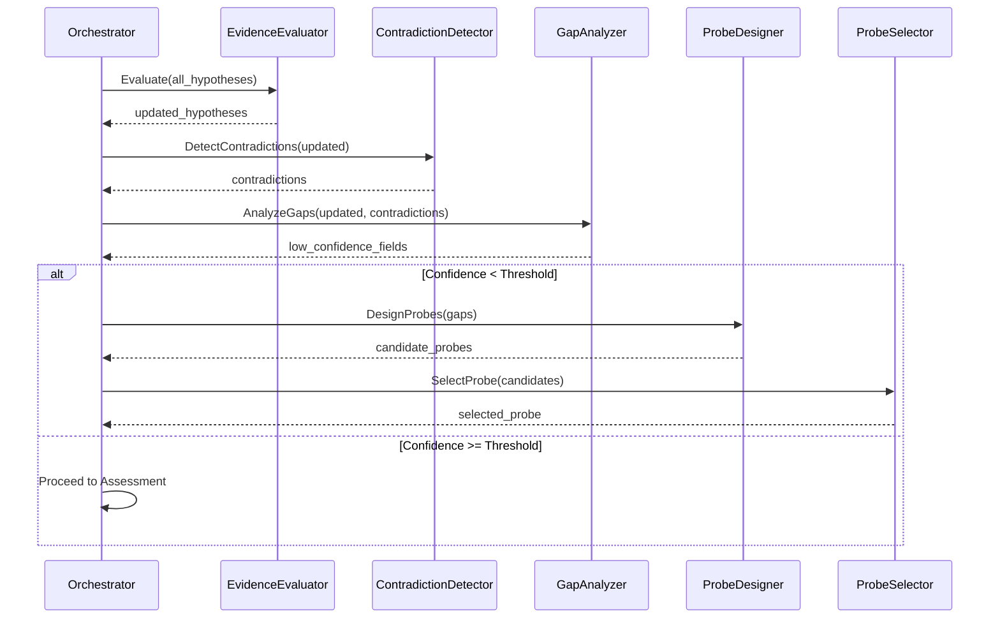

# MBP Agent Architecture v2.0 - Modular Collaborative System

## Overview

Sistem baru dengan **14+ specialized agents** yang bekerja kolaboratif, bukan sequential overload. Setiap agent punya 1-2 tugas spesifik dan berkomunikasi via shared state.

## Core Philosophy

```
Old: 6 Agents → Each does everything → Bottleneck
New: 14+ Agents → Each does one thing well → Parallel + Collaborative
```

---

## Agent Network Diagram



---

## State Flow Architecture



---

## Agent Specifications

### Layer 1: Input

#### 1. IntakeAgent
```yaml
Responsibility: Initial safety screening & session setup
Input:
  - user_message: string
  - session_context: object
Output:
  - safety_cleared: boolean
  - crisis_flags: array
  - initial_context: object
  - routing_decision: "proceed" | "halt" | "escalate"
Model: gpt-4 / kimi-k2.5
Temperature: 0.1
```

### Layer 2: Extraction (Parallel)

#### 2. LinguisticExtractor
```yaml
Responsibility: Extract linguistic patterns only
Input:
  - transcript: array
Output:
  - absolutes: array
  - qualifiers: array
  - evasion_markers: array
  - temporal_references: array
  - meta_talk: array
Model: gpt-4
Temperature: 0.2
```

#### 3. EmotionalExtractor
```yaml
Responsibility: Extract emotional markers only
Input:
  - transcript: array
Output:
  - explicit_affects: array
  - implicit_emotions: array
  - granularity_indicators: array
  - regulation_attempts: array
Model: gpt-4
Temperature: 0.2
```

#### 4. CognitiveExtractor
```yaml
Responsibility: Extract cognitive processing patterns
Input:
  - transcript: array
Output:
  - abstraction_level: score
  - causal_complexity: score
  - processing_speed_indicators: array
  - bias_patterns: array
Model: gpt-4
Temperature: 0.2
```

#### 5. BehavioralExtractor
```yaml
Responsibility: Extract behavioral/engagement cues
Input:
  - transcript: array
  - metadata: object (response times, etc)
Output:
  - engagement_patterns: array
  - avoidance_indicators: array
  - pause_patterns: array
  - topic_shift_frequency: number
Model: gpt-4
Temperature: 0.2
```

### Layer 3: Synthesis

#### 6. PatternSynthesizer
```yaml
Responsibility: Merge signals from all extractors into unified patterns
Input:
  - linguistic_signals: array
  - emotional_signals: array
  - cognitive_signals: array
  - behavioral_signals: array
Output:
  - unified_patterns: array
  - pattern_confidences: object
  - cross_domain_correlations: array
Model: gpt-4
Temperature: 0.3
```

#### 7. Contextualizer
```yaml
Responsibility: Add cultural and temporal context to patterns
Input:
  - patterns: array
  - user_context: object
Output:
  - contextualized_patterns: array
  - cultural_adjustments: array
Model: gpt-4
Temperature: 0.3
```

### Layer 4: Hypothesis Generation (Per Field)

#### 8. HGen-Attachment
```yaml
Responsibility: Generate attachment-related hypotheses only
Input:
  - contextualized_patterns: array
Output:
  - attachment_hypotheses: array (3-5)
Model: gpt-4
Temperature: 0.7
```

#### 9. HGen-Cognitive
```yaml
Responsibility: Generate cognitive structure hypotheses only
Input:
  - contextualized_patterns: array
Output:
  - cognitive_hypotheses: array (3-5)
Model: gpt-4
Temperature: 0.7
```

#### 10. HGen-Emotional
```yaml
Responsibility: Generate emotional architecture hypotheses only
Input:
  - contextualized_patterns: array
Output:
  - emotional_hypotheses: array (3-5)
Model: gpt-4
Temperature: 0.7
```

#### 11. HGen-Relational
```yaml
Responsibility: Generate power dynamics & relational hypotheses
Input:
  - contextualized_patterns: array
Output:
  - relational_hypotheses: array (3-5)
Model: gpt-4
Temperature: 0.7
```

#### 12. HGen-Defense
```yaml
Responsibility: Generate defense mechanism hypotheses
Input:
  - contextualized_patterns: array
Output:
  - defense_hypotheses: array (3-5)
Model: gpt-4
Temperature: 0.7
```

### Layer 5: Validation

#### 13. EvidenceEvaluator
```yaml
Responsibility: Bayesian update of all hypotheses
Input:
  - all_hypotheses: object (by field)
  - new_evidence: array
Output:
  - updated_hypotheses: object
  - confidence_changes: object
  - evidence_registry: array
Model: gpt-4
Temperature: 0.3
```

#### 14. ContradictionDetector
```yaml
Responsibility: Find and log inconsistencies
Input:
  - updated_hypotheses: object
  - evidence_registry: array
Output:
  - contradictions: array
  - tension_pairs: array
  - unexplained_variance: array
Model: gpt-4
Temperature: 0.2
```

#### 15. GapAnalyzer
```yaml
Responsibility: Identify confidence deficits per field
Input:
  - updated_hypotheses: object
  - contradictions: array
Output:
  - low_confidence_fields: array
  - information_gaps: array
  - probe_priorities: array
Model: gpt-4
Temperature: 0.2
```

### Layer 6: Probe Design

#### 16. ProbeDesigner
```yaml
Responsibility: Create questions for specific gaps
Input:
  - information_gaps: array
  - target_hypotheses: array
Output:
  - candidate_probes: array
  - probe_rationales: array
Model: gpt-4
Temperature: 0.5
```

#### 17. ProbeSelector
```yaml
Responsibility: Select optimal probe strategy
Input:
  - candidate_probes: array
  - session_history: array
Output:
  - selected_probe: object
  - fallback_probes: array
  - strategy_notes: string
Model: gpt-4
Temperature: 0.4
```

### Layer 7: Assessment

#### 18. TensionMapper
```yaml
Responsibility: Map cross-dimension tensions
Input:
  - updated_hypotheses: object
  - contradictions: array
Output:
  - tension_network: array
  - persona_core_gaps: array
Model: gpt-4
Temperature: 0.3
```

#### 19. MatrixPositioner
```yaml
Responsibility: Generate 12D matrix positions
Input:
  - updated_hypotheses: object
  - tension_network: array
Output:
  - matrix_12d: object
  - position_confidences: object
  - supporting_evidence: object
Model: gpt-4
Temperature: 0.2
```

#### 20. Validator
```yaml
Responsibility: Quality check final assessment
Input:
  - matrix_12d: object
  - supporting_evidence: object
Output:
  - quality_score: number
  - validation_notes: array
  - needs_reassessment: boolean
Model: gpt-4
Temperature: 0.1
```

### Layer 8: Output

#### 21. ProfileComposer
```yaml
Responsibility: Integrate all data into final profile
Input:
  - matrix_12d: object
  - tension_network: array
  - evidence_registry: array
Output:
  - final_profile: object
  - core_structure: object
  - adaptation_chains: array
Model: gpt-4
Temperature: 0.4
```

#### 22. Explainer
```yaml
Responsibility: Generate user-friendly explanation
Input:
  - final_profile: object
Output:
  - executive_summary: string
  - user_report: object
  - recommendations: array
Model: gpt-4
Temperature: 0.5
```

---

## Collaboration Patterns

### Pattern 1: Parallel Extraction


### Pattern 2: Per-Field Hypothesis Race


### Pattern 3: Validation Loop


---

## Implementation Benefits

### Performance
- **Parallel Extraction**: 4 extractors run simultaneously → ~4x speedup
- **Per-Field Hypothesis**: 5 generators in parallel → ~5x speedup
- **Focused Agents**: Smaller prompts → faster inference

### Quality
- **Specialization**: Each agent optimized for specific task
- **Collaboration**: Cross-validation between agents
- **Debugging**: Easy to isolate issues per agent

### Maintainability
- **Modularity**: Add/remove agents without breaking flow
- **Testing**: Unit test each agent independently
- **Scaling**: Scale individual agents based on load

---

## Migration from v1 to v2

### Phase 1: Extractor Layer
- Split Analyzer into 4 extractors
- Add PatternSynthesizer
- Keep v1 agents as fallback

### Phase 2: Hypothesis Layer
- Split HypothesisMaker into per-field agents
- Add EvidenceEvaluator
- Add ContradictionDetector

### Phase 3: Assessment Layer
- Add TensionMapper
- Split Assessor into MatrixPositioner + Validator

### Phase 4: Output Layer
- Add Explainer
- Refine ProfileComposer

---

*MBP Agent Architecture v2.0 - Modular Collaborative Design*
*Dr. Zemetia Research Division*
